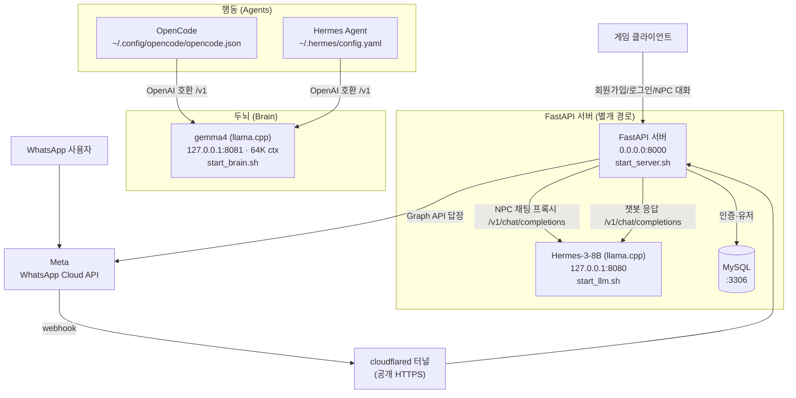

# ViveCoding — LLM · Agent Connection

**두뇌(LLM)와 행동(Agent)을 분리해 연결하는** 로컬 AI 구성 + FastAPI 게임 서버 프로젝트.

- **두뇌 (Brain)** = 사고를 담당하는 로컬 LLM (llama.cpp)
- **행동 (Agent)** = 코딩·실행을 담당하는 에이전트 (OpenCode, Hermes Agent)
- 두 에이전트가 하나의 두뇌 LLM에 OpenAI 호환 API로 연결됨
- 별도로, FastAPI 게임 서버가 NPC 채팅용 LLM을 사용
- **WhatsApp 챗봇** — WhatsApp Cloud API 웹훅이 로컬 LLM을 직접 호출해 답장

모든 LLM은 **로컬(llama.cpp)** 에서 구동되어 외부 API 비용·의존이 없습니다.

---

## 워크플로우



> **주의:** "Hermes"가 두 곳에 나옵니다 — (1) NPC용 **Hermes-3-8B 모델**, (2) 코딩 에이전트 도구 **Hermes Agent**. 서로 다른 것입니다.

---

## 구성 요소

| 구성 | 역할 | 포트 | 모델 |
|---|---|---|---|
| **gemma4 두뇌** | OpenCode / Hermes Agent의 사고 엔진 | `8081` | `gemma-4-E2B-it-Q8_0.gguf` |
| **NPC LLM** | FastAPI 게임 서버의 NPC 대화 | `8080` | `Hermes-3-Llama-3.1-8B.Q4_K_M.gguf` |
| **FastAPI 서버** | 인증 + NPC 채팅 + WhatsApp 웹훅 API | `8000` | — |
| **WhatsApp 챗봇** | WhatsApp Cloud API 웹훅 → 로컬 LLM 응답 | `8000` (`/whatsapp/webhook`) | Hermes-3-8B(`8080`) |
| **MySQL** | 유저 저장소 | `3306` | — |

에이전트 → 두뇌 연결 설정 (저장소 밖, 각 홈 디렉토리):

| 에이전트 | 설정 파일 | 연결 |
|---|---|---|
| OpenCode | `~/.config/opencode/opencode.json` | provider `llamacpp` → `http://127.0.0.1:8081/v1`, model `llamacpp/gemma4` |
| Hermes Agent | `~/.hermes/config.yaml` | provider `custom` → `http://127.0.0.1:8081/v1`, model `gemma4` |

---

## 디렉토리 구조

```
ViveCoding_LLM-AgentConnection/
├── Server/                     # FastAPI 게임 서버
│   ├── main.py                 # 앱 진입점 (/health)
│   ├── routers/
│   │   ├── auth.py             # /auth/signup, /auth/login, /auth/withdraw
│   │   ├── npc.py              # /npc/chat, /npc/reset (→ llama.cpp 프록시)
│   │   └── whatsapp.py         # /whatsapp/webhook (WhatsApp Cloud API 챗봇)
│   ├── models.py               # User 테이블 (SQLAlchemy)
│   ├── config.py               # 환경설정 (.env)
│   ├── security.py, deps.py    # JWT · 의존성
│   ├── start_server.sh         # 서버 실행 스크립트
│   └── .env.example            # 환경변수 템플릿
└── llmserver/                  # 로컬 LLM 서버
    ├── start_brain.sh          # gemma4 두뇌 (8081)
    └── start_llm.sh            # Hermes-3-8B NPC (8080)
```

> **git 제외 항목** (`.gitignore`): 모델 가중치 `*.gguf`(약 9.5GB), llama.cpp 바이너리, `venv/`, `.env`(비밀키), 로그.

---

## 설치 및 실행

### 1. 사전 준비
- Python 3.12, MySQL, llama.cpp 바이너리(`llmserver/bin/`), 모델 GGUF(`llmserver/models/`)
- `Server/.env` 작성 (`Server/.env.example` 참고 — DB 접속정보·`JWT_SECRET_KEY` 등)

### 2. 두뇌 LLM (에이전트용)
```bash
./llmserver/start_brain.sh          # gemma4 → 127.0.0.1:8081 (64K 컨텍스트)
```

### 3. 게임 서버 + NPC LLM
```bash
./llmserver/start_llm.sh            # Hermes-3-8B → 127.0.0.1:8080
cd Server && ./start_server.sh      # FastAPI → 0.0.0.0:8000
```

### 4. 에이전트 실행 (두뇌에 연결됨)
```bash
opencode                            # 또는
hermes
```

---

## 주요 API (FastAPI, `:8000`)

| 메서드 | 경로 | 설명 |
|---|---|---|
| GET | `/health` | 헬스체크 |
| POST | `/auth/signup` | 회원가입 |
| POST | `/auth/login` | 로그인 (JWT 발급) |
| POST | `/auth/withdraw` | 회원 탈퇴 |
| POST | `/npc/chat` | NPC 대화 (LLM 응답) |
| POST | `/npc/reset` | NPC 대화 기록 초기화 |
| GET | `/whatsapp/webhook` | WhatsApp 웹훅 검증 핸드셰이크 |
| POST | `/whatsapp/webhook` | WhatsApp 메시지 수신 → LLM 응답 답장 |

API 문서: 서버 실행 후 `http://<host>:8000/docs`

---

## WhatsApp 챗봇 설정

두 가지 방식이 있습니다.

- **방식 A — 공식 Cloud API** (아래): FastAPI 웹훅(`routers/whatsapp.py`)이 로컬 LLM으로 답장. Meta 비즈니스 계정·공개 웹훅 필요.
- **방식 B — Hermes Agent (Baileys 셀프챗)** (맨 아래): 개인 WhatsApp을 QR로 연결. Meta 계정 불필요. **현재 작동 중인 방식.**

---

### 방식 A — 공식 WhatsApp Cloud API

WhatsApp Cloud API 웹훅이 메시지를 받아 로컬 LLM(`8080`)이 답장을 생성합니다.
서명 검증(`X-Hub-Signature-256`) → 발신자별 대화기록 → 백그라운드 처리로 웹훅 즉시 200 반환.

#### 필요한 환경변수 (`Server/.env`)

| 변수 | 설명 |
|---|---|
| `WHATSAPP_VERIFY_TOKEN` | 웹훅 검증용, 직접 정하는 임의 문자열 (Meta 웹훅 설정에도 동일 입력) |
| `WHATSAPP_TOKEN` | Meta 액세스 토큰 (임시 24h 또는 System User 영구 토큰) |
| `WHATSAPP_PHONE_NUMBER_ID` | Meta API Setup의 Phone number ID |
| `WHATSAPP_APP_SECRET` | Meta 앱 설정 > 기본 설정 > 앱 시크릿 (서명 검증용) |
| `WHATSAPP_LLM_URL` | 응답 생성 LLM 주소 (기본 `http://127.0.0.1:8080`) |

> 미설정 시 웹훅은 비활성(403)이며 서버는 정상 기동됩니다.

#### 공개 웹훅 (홈 서버 → 공개 HTTPS)

```bash
cloudflared tunnel --url http://localhost:8000
# 출력된 https://<random>.trycloudflare.com 이 공개 주소
```

Meta 웹훅 설정:
- **Callback URL:** `https://<random>.trycloudflare.com/whatsapp/webhook`
- **Verify token:** `WHATSAPP_VERIFY_TOKEN`과 동일하게
- **구독 필드:** `messages`

> quick tunnel은 재시작 시 URL이 바뀌므로 Callback URL도 갱신 필요. 계정·번호 정식 등록 및 24시간 응답 창(customer service window) 등 Cloud API 정책 유의.

---

### 방식 B — Hermes Agent (Baileys 셀프챗) · **현재 작동**

Meta 계정 없이 **개인 WhatsApp을 QR로 연결**해 쓰는 방식. 응답은 Hermes Agent가
gemma4 두뇌(`8081`)로 생성합니다. 설정·인증은 모두 `~/.hermes/`에 저장되며
(**WhatsApp 세션 인증 포함 → git 커밋 금지**), 이 저장소에는 재현 절차만 문서화합니다.

```bash
# 1) Hermes Agent 설치 (최초 1회)
curl -fsSL https://hermes-agent.nousresearch.com/install.sh | bash -s -- --skip-setup

# 2) Hermes → gemma4 두뇌 연결 (~/.hermes/config.yaml)
#    provider: custom / base_url: http://127.0.0.1:8081/v1 / default: gemma4

# 3) WhatsApp 페어링 (QR을 폰의 '연결된 기기'로 스캔)
hermes whatsapp

# 4) 셀프챗 모드로 설정 (~/.hermes/.env)
#    WHATSAPP_MODE=self-chat
#    WHATSAPP_ALLOWED_USERS=<본인 국제형식 번호, 예: 8210XXXXXXXX>

# 5) 두뇌 실행 후 게이트웨이 실행
./llmserver/start_brain.sh          # 별도 터미널, gemma4 @ 8081
hermes gateway run                  # 메시지 수신·응답 시작
```

- WhatsApp **"나에게 메시지(Message Yourself)"** 에 보내면 `⚕ Hermes Agent` 접두어로 답장.
- ⚠️ 현재 CPU 추론이라 응답에 수 분 소요 → GPU 활성화 시 개선(아래 남은 과제).

---

## 현재 상태 / 남은 과제

- ✅ **OpenCode → gemma4 두뇌**: 연결·동작 검증 완료
- ⚠️ **Hermes Agent → gemma4 두뇌**: 연결은 되나 **CPU 추론이 느려** 실사용이 어려움
- ✅ **WhatsApp (방식 B, Hermes Baileys 셀프챗)**: QR 페어링 → 셀프챗 → gemma4 답장 **작동 확인**
- ⏳ **WhatsApp (방식 A, Cloud API)**: 코드 검증 완료, Meta 개발자 계정 인증 이슈로 실연결 보류
- ⚠️ **GPU 미사용**: RTX 3060(12GB) 보유 중이나 드라이버 버전 불일치 상태
  - **재부팅** → 드라이버 정상화 → llama.cpp **CUDA 빌드** → `start_*.sh`의 `NGL=0` → `99`
  - GPU 가속 시 에이전트 속도 문제 해결 예상
